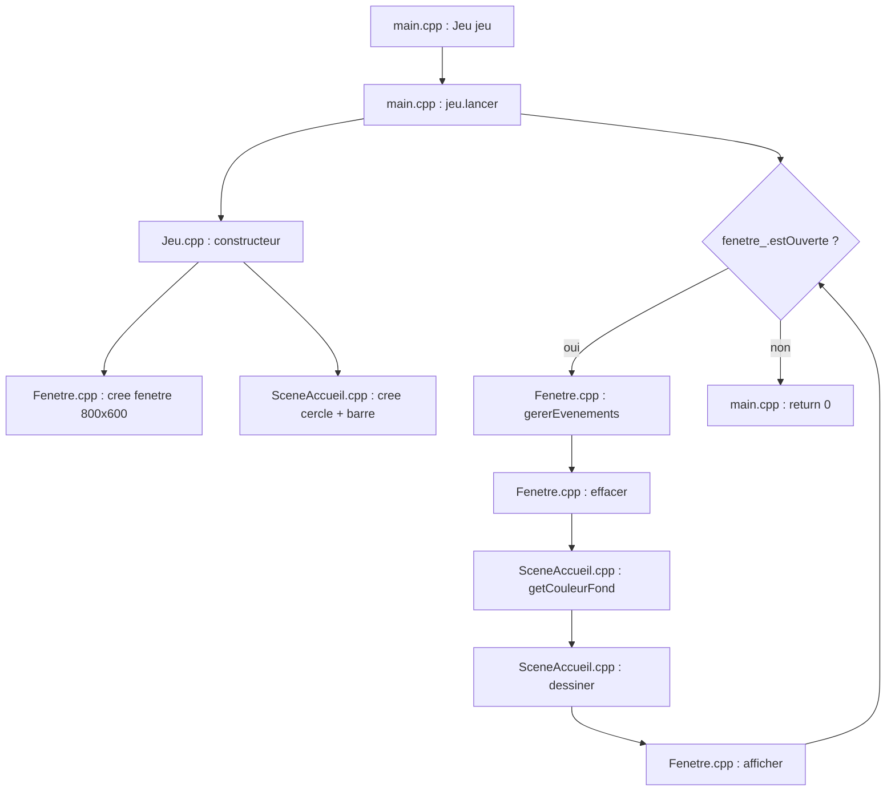

# Workflow — Fonctionnalité : Fenêtre SFML + scène d'accueil

> Document de suivi du flux d'exécution entre les fichiers `.cpp`.  
> Une section sera ajoutée à chaque nouvelle fonctionnalité.

---

## Fichiers concernés

| Fichier | Rôle |
|---------|------|
| `src/main.cpp` | Point d'entrée du programme |
| `src/Jeu.cpp` | Orchestre la boucle principale |
| `src/Fenetre.cpp` | Gère la fenêtre SFML et les événements |
| `src/SceneAccueil.cpp` | Gère le contenu visuel affiché |

---

## Vue d'ensemble

```
main.cpp
   │
   ▼
Jeu.cpp ──────────────┬──────────────────┐
   │                  │                  │
   ▼                  ▼                  ▼
Fenetre.cpp    SceneAccueil.cpp    (boucle infinie)
```

Le **Jeu** est le chef d'orchestre : il appelle **Fenetre** pour la fenêtre et **SceneAccueil** pour le dessin.

---

## Flux complet (du démarrage à la fermeture)



---

## Étape 1 — Démarrage (`main.cpp` → `Jeu.cpp`)

1. `main()` crée un objet `Jeu`.
2. Le constructeur `Jeu::Jeu()` s'exécute :
   - `fenetre_(800, 600, "Xwing")` → appelle `Fenetre::Fenetre()`
   - `sceneAccueil_()` → appelle `SceneAccueil::SceneAccueil()`
3. `main()` appelle `jeu.lancer()`.

---

## Étape 2 — Initialisation de la fenêtre (`Fenetre.cpp`)

**Constructeur `Fenetre::Fenetre(largeur, hauteur, titre)`**

```
Fenetre::Fenetre(800, 600, "Xwing")
   │
   ├─► sf::VideoMode(800, 600, 32)  →  définit la résolution
   ├─► sf::RenderWindow(...)        →  ouvre la fenêtre "Xwing"
   └─► setFramerateLimit(60)        →  limite à 60 FPS
```

**Méthodes utilisées dans la boucle :**

| Méthode | Action |
|---------|--------|
| `estOuverte()` | Retourne `true` tant que la fenêtre n'est pas fermée |
| `gererEvenements()` | Lit clavier / souris / fermeture |
| `effacer(couleur)` | Vide l'écran avec la couleur de fond |
| `afficher()` | Affiche l'image à l'écran |
| `getRenderWindow()` | Donne accès à la fenêtre pour dessiner |

**Workflow `gererEvenements()` :**

```
gererEvenements()
   │
   └─► while (pollEvent(event))
         │
         ├─► Event::Closed        →  fenetre_.close()
         └─► Event::KeyPressed
               └─► Escape          →  fenetre_.close()
```

---

## Étape 3 — Initialisation de la scène (`SceneAccueil.cpp`)

**Constructeur `SceneAccueil::SceneAccueil()`**

```
SceneAccueil::SceneAccueil()
   │
   ├─► couleurFond_ = bleu foncé (20, 30, 60)
   ├─► cercle_ = rayon 40, position (360, 260), orange + contour blanc
   └─► barre_  = 800x40, position (0, 560), gris
```

**Méthodes utilisées dans la boucle :**

| Méthode | Action |
|---------|--------|
| `getCouleurFond()` | Retourne la couleur passée à `Fenetre::effacer()` |
| `dessiner(fenetre)` | Dessine la barre puis le cercle |

**Workflow `dessiner()` :**

```
dessiner(fenetre)
   │
   ├─► fenetre.draw(barre_)
   └─► fenetre.draw(cercle_)
```

---

## Étape 4 — Boucle principale (`Jeu.cpp`)

**Méthode `Jeu::lancer()`**

```
lancer()
   │
   └─► while (fenetre_.estOuverte())
         │
         │  1. fenetre_.gererEvenements()              ← Fenetre.cpp
         │  2. fenetre_.effacer(sceneAccueil_.getCouleurFond())  ← Fenetre + SceneAccueil
         │  3. sceneAccueil_.dessiner(fenetre_.getRenderWindow()) ← SceneAccueil + Fenetre
         │  4. fenetre_.afficher()                     ← Fenetre.cpp
         │
         └─► (retour au début de la boucle)
```

Cette boucle s'exécute **60 fois par seconde** (grâce au `setFramerateLimit(60)`).

---

## Ordre d'appel par frame (1 image)

| # | Fichier | Méthode | Résultat |
|---|---------|---------|----------|
| 1 | `Fenetre.cpp` | `gererEvenements()` | Détecte Échap ou croix |
| 2 | `SceneAccueil.cpp` | `getCouleurFond()` | Fournit le bleu foncé |
| 3 | `Fenetre.cpp` | `effacer(couleur)` | Écran vidé |
| 4 | `Fenetre.cpp` | `getRenderWindow()` | Accès à la fenêtre |
| 5 | `SceneAccueil.cpp` | `dessiner(fenetre)` | Barre + cercle dessinés |
| 6 | `Fenetre.cpp` | `afficher()` | Image affichée à l'écran |

---

## Fin du programme

1. L'utilisateur appuie sur **Échap** ou clique sur la **croix**.
2. `Fenetre::gererEvenements()` appelle `fenetre_.close()`.
3. `fenetre_.estOuverte()` retourne `false`.
4. La boucle `while` dans `Jeu::lancer()` s'arrête.
5. `main()` retourne `0`.

---

## Résumé des responsabilités

```
┌─────────────────┐
│     Jeu.cpp     │  "Quand et dans quel ordre ?"
│   (orchestrateur)│
└────────┬────────┘
         │
    ┌────┴────┐
    ▼         ▼
┌─────────┐ ┌──────────────┐
│Fenetre  │ │ SceneAccueil │
│  .cpp   │ │     .cpp     │
│         │ │              │
│ Fenêtre │ │   Dessin     │
│ Events  │ │   Formes     │
│ Affich. │ │   Couleurs   │
└─────────┘ └──────────────┘
```

---

<!-- Prochaine fonctionnalité : ajouter une section "## Fonctionnalité : ..." ci-dessous -->
